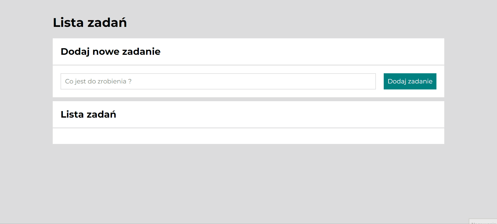

# Task List 

## Demo

This page is available for preview here: https://marcin-malek.github.io/task_list/

## About

This web application is a part of frontend developer course that I have taken. It was created using technologies such as:

- HTML (BEM Convention)
- CSS (BEM Convention, Flex, Google Fonts, Media Queries, Normalize.css)
- JS (ES6)
- Git

### Functionality

Task List project helps user manage his tasks. It allows You to create completely new task or delete and mark chosen task as done.

Described functionalities are shortly presented below:

